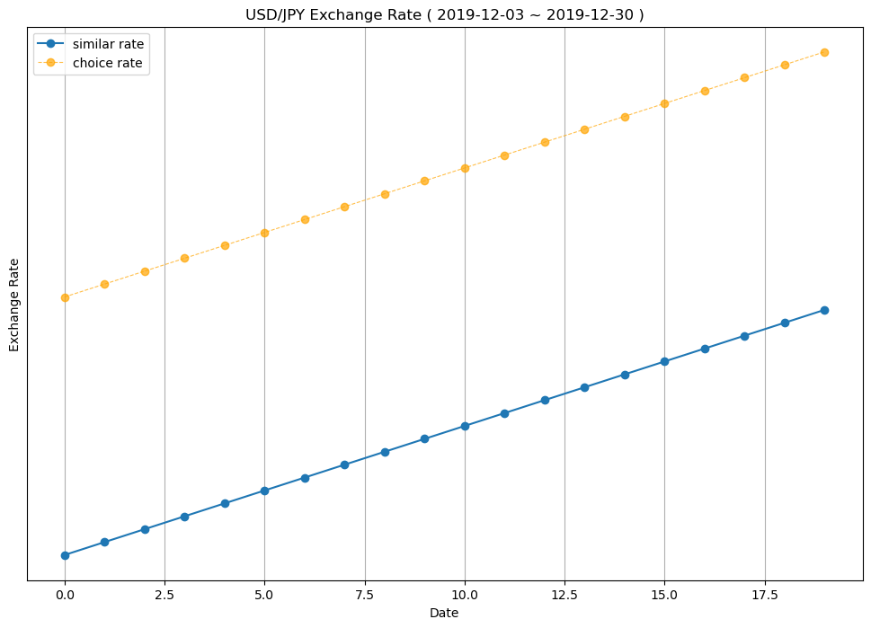

# similar_rates

This code searches for a range of historical exchange rates that is similar to the specified range. It will gather reference material for predicting future exchange rates. Currencies supported include.

| コード | 国名 | 通貨名 |
|------------|------------------|-------------------------|
| USDJPY   | アメリカ         | ドル                    |
| GBPJPY   | イギリス         | ポンド                  |
| INRJPY   | インド           | ルピー                  |
| IDRJPY   | インドネシア     | ルピア                  |
| EGPJPY   | エジプト         | ポンド                  |
| AUDJPY   | オーストラリア   | ドル                    |
| CADJPY   | カナダ           | ドル                    |
| KRWJPY   | 韓国             | ウォン                  |
| KWDJPY   | クウェート       | ディナール              |
| COPJPY   | コロンビア       | ペソ                    |
| SARJPY   | サウジアラビア   | リヤル                  |
| SGDJPY   | シンガポール     | ドル                    |
| CHFJPY   | スイス           | フラン                  |
| SEKJPY   | スウェーデン     | クローナ                |
| THBJPY   | タイ             | バーツ                  |
| TWDJPY   | 台湾             | ドル                    |
| CNYJPY   | 中国             | 元                      |
| CLPJPY   | チリ             | ペソ                    |
| DKKJPY   | デンマーク       | クローネ                |
| TRYJPY   | トルコ           | リラ                    |
| NZDJPY   | ニュージーランド   | ドル                    |
| NOKJPY   | ノルウェー       | クローネ                |
| PYGJPY   | パラグアイ       | グァラニ                |
| PHPJPY   | フィリピン       | ペソ                    |
| BRLJPY   | ブラジル         | レアル                  |
| VESJPY   | ベネズエラ       | ボリバル・ソベラノ      |
| PENJPY   | ペルー           | ソル                    |
| HKDJPY   | 香港             | ドル                    |
| MYRJPY   | マレーシア       | リンギット              |
| ZARJPY   | 南アフリカ       | ランド                  |
| MXNJPY   | メキシコ         | ペソ                    |
| AEDJPY   | UAE              | ディルハム              |
| EURJPY   | 欧州             | ユーロ                  |
| JODJPY   | ヨルダン         | ディナール              |
| RONJPY   | ルーマニア       | レウ                    |
| LBPJPY   | レバノン         | ポンド                  |
| RUBJPY   | ロシア           | ルーブル                |

# simple example

One request returns four candidates.

```
pip install ExchangeComparison
```
default:
money_kind = 'USDJPY',
date = 'Today',
days = 20,

```python
from ExchangeComparison import Exchange

e = Exchange(money_kind='USDJPY')
e.get_exchange(date='2010-01-04',days=20)
```


